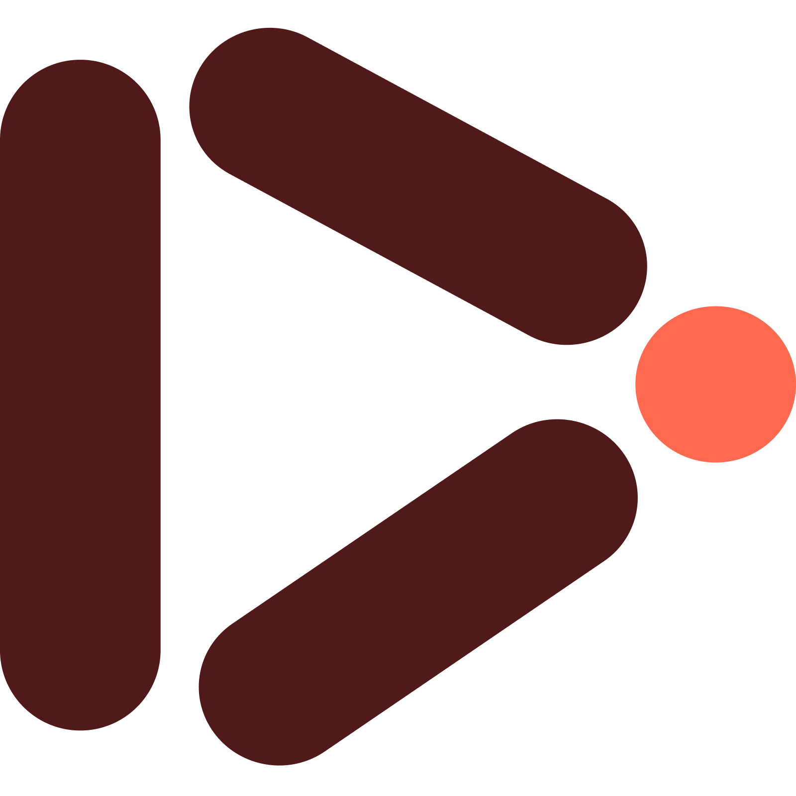

<div align="center">
  

  # ⚡ StreamCraft
  **Next-Gen YouTube & YouTube Music HD Downloader**

  <p align="center">
    A blazing-fast, modern web application for downloading YouTube videos (up to 1080p Full HD), converting audio to genuine MP3 (320kbps), and batch-downloading full YouTube & YouTube Music playlists as ZIP archives with real-time download speed metrics and live SSE progress.
  </p>

  <p align="center">
    
    
    
    
    
    
    
    
  </p>
</div>

---

## 🌟 Key Features

- **🎬 Full HD Video Downloads**: Download crystal-clear 1080p, 720p, 480p, and 360p MP4 videos with merged audio.
- **🎵 Genuine MP3 Audio Conversion**: Extract and convert audio to genuine `192kbps/320kbps .mp3` using embedded static FFmpeg.
- **⚡ Live Speed & Metrics Dashboard**: Real-time download transfer rate gauge (e.g. `12.4 MB/s`), live MB progress counter, and countdown ETA.
- **📦 Playlist ZIP Downloads via SSE**: Batch-download YouTube and YouTube Music playlists directly into a ZIP archive with live track-by-track Server-Sent Events (SSE) progress.
- **🌐 YouTube & YouTube Music Support**: Seamlessly parses regular videos, Shorts (`/shorts/`), youtu.be links, and YouTube Music (`music.youtube.com`) playlists.
- **🎨 Interactive WebGL Scanner Background**: Features the React Bits WebGL Scanner background with custom Dark & Light mode color schemes.
- **📱 Responsive & PWA Ready**: Fully responsive mobile layout with Apple Touch Icons and `manifest.json` for home screen installation on iOS, Android, and desktop.
- **☁️ Zero-Config Vercel Deployment**: Serverless Python backend configured via `vercel.json` for one-click deployment.

---

## 🛠️ Tech Stack

| Layer | Technologies |
|---|---|
| **Frontend** | React 19, Vite, Tailwind CSS v4, OGL (WebGL), Lucide Icons |
| **Backend** | Python 3.9+, FastAPI, Uvicorn, Pydantic |
| **Download Engine** | `yt-dlp`, `static-ffmpeg`, `pytubefix` |
| **Protocol & Streaming** | Server-Sent Events (SSE), HTTP Chunked Streaming, RFC 5987 UTF-8 Headers |
| **Deployment** | Vercel (Frontend + Serverless Functions) |

---

## 📁 Repository Structure

```
youtube-downloader-app/
├── api/
│   ├── index.py              # FastAPI server & Vercel Serverless Function
│   └── requirements.txt      # Python runtime dependencies
├── public/
│   ├── logo-clear.png        # Transparent brand logo for UI
│   ├── logo.png              # App icon & Favicon
│   └── manifest.json         # PWA Web App Manifest
├── src/
│   ├── components/
│   │   ├── DownloadAction.jsx# Live speed gauge, progress bar & metrics grid
│   │   ├── FormatSelector.jsx# Resolution & bitrate cards (Video / Audio)
│   │   ├── PlaylistView.jsx  # Playlist tracks & batch ZIP download UI
│   │   ├── Scanner.jsx       # React Bits WebGL Scanner canvas
│   │   ├── StepIndicator.jsx # Responsive 1-2-3 step tracker
│   │   ├── UrlInput.jsx      # URL input with 1-click clipboard paste
│   │   ├── VideoCard.jsx     # Video thumbnail & metadata preview
│   │   └── Features.jsx      # Feature highlights grid
│   ├── App.jsx               # Main state orchestrator & theme manager
│   ├── index.css             # Glassmorphic styling & responsive design tokens
│   └── main.jsx              # React DOM root
├── index.html                # Entry HTML with PWA & iOS meta tags
├── package.json              # Frontend scripts & npm dependencies
├── requirements.txt          # Python dependencies
├── vercel.json               # Vercel routing & serverless configuration
└── vite.config.js            # Vite configuration & /api proxy
```

---

## 🚀 Getting Started

### Prerequisites
Make sure you have the following installed on your system:
- **Node.js**: `v18.0.0` or higher ([Download Node.js](https://nodejs.org/))
- **Python**: `v3.9` or higher ([Download Python](https://www.python.org/))
- **Git**: ([Download Git](https://git-scm.com/))

---

### 1. Clone the Repository
```bash
git clone https://github.com/<your-username>/youtube-downloader-app.git
cd youtube-downloader-app
```

### 2. Install Dependencies

#### Install Frontend Dependencies:
```bash
npm install
```

#### Install Backend Dependencies:
```bash
pip install -r requirements.txt
```

---

### 3. Run Locally

Start both the **FastAPI backend** and **Vite frontend** concurrently with a single command:

```bash
npm start
```

- **Frontend**: [http://localhost:5173](http://localhost:5173)
- **Backend API**: [http://127.0.0.1:8000](http://127.0.0.1:8000)
- **Interactive API Docs (Swagger)**: [http://127.0.0.1:8000/docs](http://127.0.0.1:8000/docs)

---

## ☁️ Deployment on Vercel

StreamCraft is pre-configured for seamless 1-click deployment on **Vercel**:

### Method 1: Deploy via Vercel Dashboard (Recommended)
1. Push your repository to **GitHub**.
2. Visit [vercel.com/new](https://vercel.com/new) and log in.
3. Import your `youtube-downloader-app` repository.
4. Vercel will automatically detect **Vite** and configure the `/api` directory as Python serverless functions.
5. Click **Deploy**.

### Method 2: Deploy via Vercel CLI
```bash
npm install -g vercel
vercel
```

---

## 🤝 Contributing

Contributions make the open-source community an amazing place to learn, inspire, and create. Any contributions you make are **greatly appreciated**!

### How to Contribute:
1. **Fork** the project.
2. **Create your feature branch**:
   ```bash
   git checkout -b feature/amazing-feature
   ```
3. **Commit your changes**:
   ```bash
   git commit -m "feat: add amazing feature"
   ```
4. **Push to the branch**:
   ```bash
   git push origin feature/amazing-feature
   ```
5. **Open a Pull Request** against the `main` branch.

---

## 📜 License

Distributed under the **MIT License**. See `LICENSE` for more information.

---

## ⚠️ Disclaimer

StreamCraft is intended for **educational and personal archival purposes only**. Please respect YouTube's Terms of Service and the intellectual property rights of content creators.
